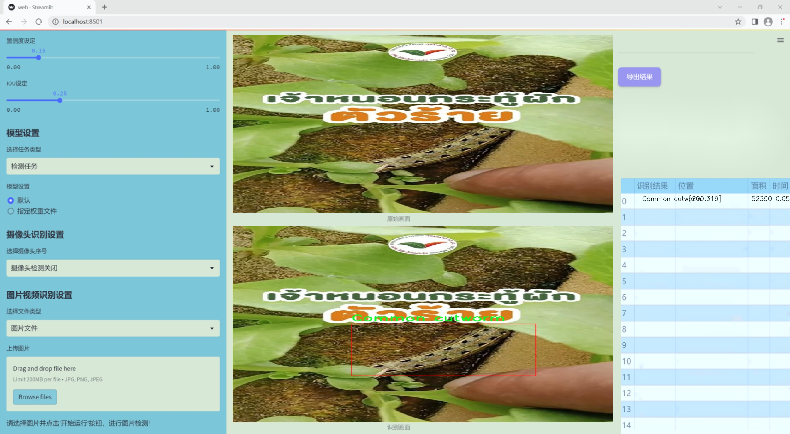
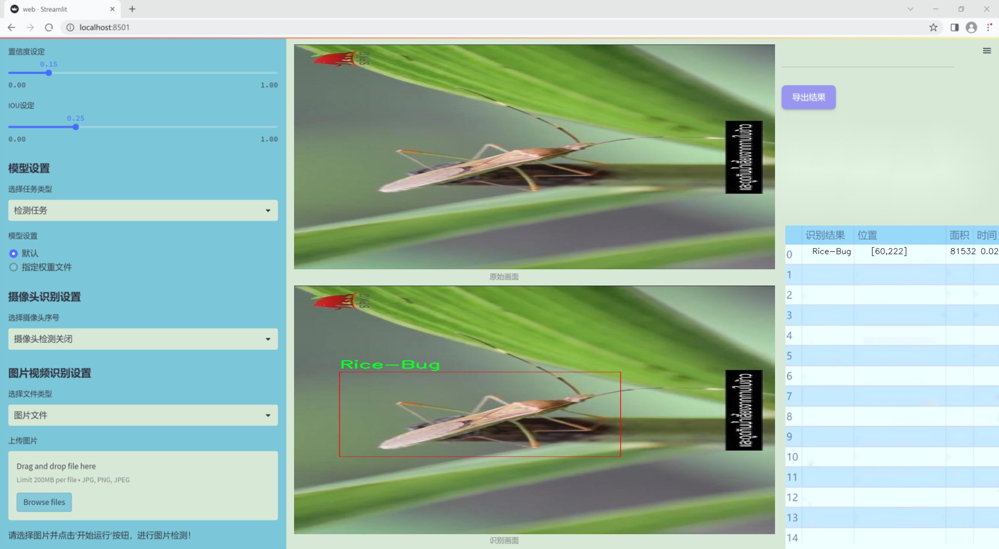
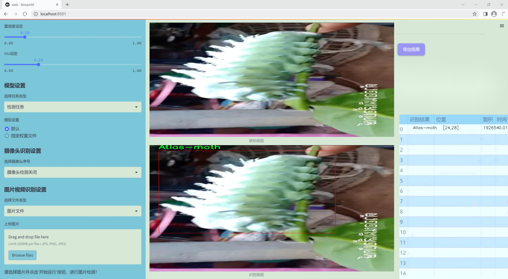
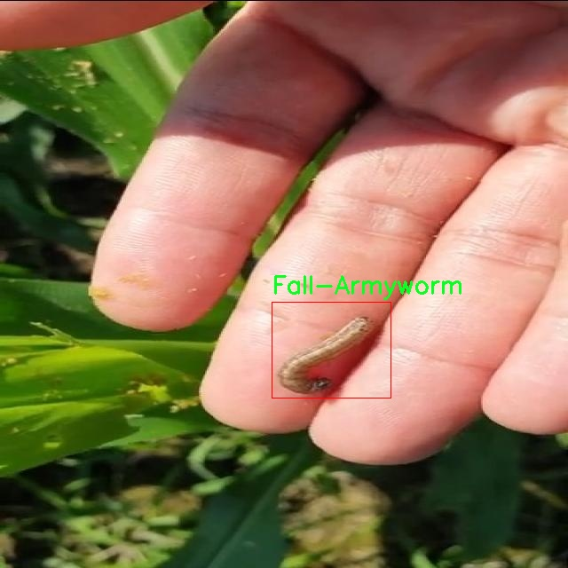
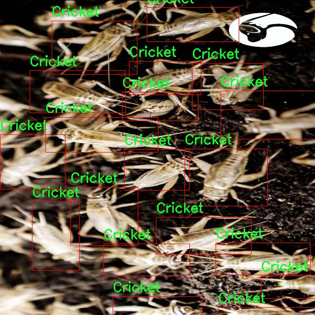
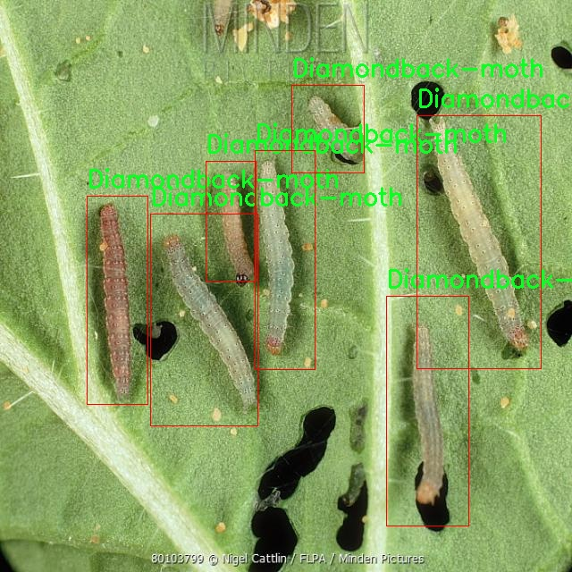
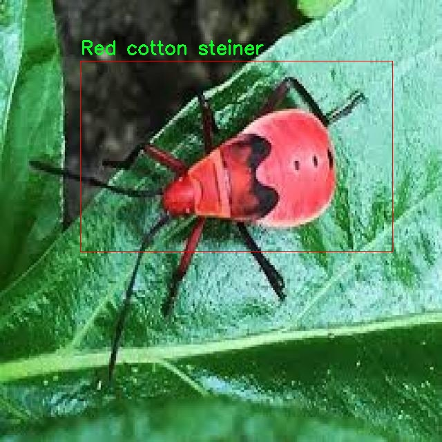
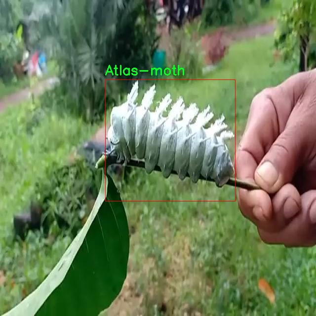

### 1.背景意义

研究背景与意义

随着全球农业生产的不断发展，农作物害虫的识别与防治成为保障粮食安全和提高农业产量的重要环节。传统的害虫识别方法往往依赖于人工观察，不仅耗时耗力，而且容易受到主观因素的影响，导致识别的准确性和效率低下。近年来，计算机视觉技术的快速发展为农作物害虫的自动识别提供了新的解决方案。尤其是基于深度学习的目标检测算法，如YOLO（You Only Look Once），因其高效性和实时性而受到广泛关注。

本研究旨在基于改进的YOLOv11算法，构建一个高效的农作物害虫识别系统。该系统将能够识别18种不同类型的害虫，包括常见的如黑草毛虫、稻虫、白蛴螬等，涵盖了农作物生长过程中可能遭遇的主要害虫。这些害虫不仅对农作物造成直接的损害，还可能引发连锁反应，影响生态平衡和农业可持续发展。因此，及时、准确地识别和监测这些害虫，对于农民采取有效的防治措施至关重要。

本研究所使用的数据集包含4901张经过精心标注的图像，涵盖了多种环境和条件下的害虫样本。通过对数据集的预处理和增强，确保了模型在多样化场景下的鲁棒性和适应性。此外，改进的YOLOv11算法将结合最新的计算机视觉技术，提升识别精度和速度，满足实际应用需求。

综上所述，基于改进YOLOv11的农作物害虫识别系统的研究，不仅具有重要的理论意义，还有助于推动农业智能化发展，提升农作物生产效率，保障粮食安全，具有广泛的应用前景和社会价值。

### 2.视频效果

[2.1 视频效果](https://www.bilibili.com/video/BV1E9BYY8EtX/)

### 3.图片效果







##### [项目涉及的源码数据来源链接](https://kdocs.cn/l/cszuIiCKVNis)**

注意：本项目提供训练的数据集和训练教程,由于版本持续更新,暂不提供权重文件（best.pt）,请按照6.训练教程进行训练后实现上图演示的效果。

### 4.数据集信息

##### 4.1 本项目数据集类别数＆类别名

nc: 18
names: ['Atlas-moth', 'Black-Grass-Caterpillar', 'Coconut-black-headed-caterpillar', 'Common cutworm', 'Cricket', 'Diamondback-moth', 'Fall-Armyworm', 'Grasshopper', 'Green-weevil', 'Leaf-eating-caterpillar', 'Oriental-Mole-Cricket', 'Oriental-fruit-fly', 'Oryctes-rhinoceros', 'Red cotton steiner', 'Rice-Bug', 'Stem-borer', 'The-Plain-Tiger', 'White-grub']


该项目为【目标检测】数据集，请在【训练教程和Web端加载模型教程（第三步）】这一步的时候按照【目标检测】部分的教程来训练

##### 4.2 本项目数据集信息介绍

本项目数据集信息介绍

本项目所使用的数据集旨在为改进YOLOv11的农作物害虫识别系统提供强有力的支持，特别关注于泰国地区的害虫种类。该数据集涵盖了18个不同的害虫类别，具体包括：Atlas-moth、Black-Grass-Caterpillar、Coconut-black-headed-caterpillar、Common cutworm、Cricket、Diamondback-moth、Fall-Armyworm、Grasshopper、Green-weevil、Leaf-eating-caterpillar、Oriental-Mole-Cricket、Oriental-fruit-fly、Oryctes-rhinoceros、Red cotton steiner、Rice-Bug、Stem-borer、The-Plain-Tiger以及White-grub。这些害虫在泰国的农业生态系统中具有重要的经济影响，能够对农作物造成严重的损害，因此准确识别和监测这些害虫是提高农业生产力和保障粮食安全的关键。

数据集中的图像样本经过精心挑选，确保涵盖了不同生长阶段、不同环境条件下的害虫表现，以提高模型的泛化能力和准确性。每个类别的样本数量均衡，力求在训练过程中避免模型对某一特定类别的偏见。此外，数据集还包含了丰富的注释信息，包括每个样本的类别标签和位置信息，这为后续的目标检测和分类任务提供了基础。

通过使用该数据集，研究人员能够有效地训练和优化YOLOv11模型，使其在识别和分类泰国农作物害虫方面表现出色。这不仅有助于提高农业害虫管理的效率，还能为农民提供及时的决策支持，从而降低农作物损失，提升整体农业生产的可持续性。总之，本项目的数据集为实现精准农业提供了重要的数据基础，推动了智能农业技术的发展。











### 5.全套项目环境部署视频教程（零基础手把手教学）

[5.1 所需软件PyCharm和Anaconda安装教程（第一步）](https://www.bilibili.com/video/BV1BoC1YCEKi/?spm_id_from=333.999.0.0&vd_source=bc9aec86d164b67a7004b996143742dc)


[5.2 安装Python虚拟环境创建和依赖库安装视频教程（第二步）](https://www.bilibili.com/video/BV1ZoC1YCEBw?spm_id_from=333.788.videopod.sections&vd_source=bc9aec86d164b67a7004b996143742dc)

### 6.改进YOLOv11训练教程和Web_UI前端加载模型教程（零基础手把手教学）

[6.1 改进YOLOv11训练教程和Web_UI前端加载模型教程（第三步）](https://www.bilibili.com/video/BV1BoC1YCEhR?spm_id_from=333.788.videopod.sections&vd_source=bc9aec86d164b67a7004b996143742dc)


按照上面的训练视频教程链接加载项目提供的数据集，运行train.py即可开始训练



     Epoch   gpu_mem       box       obj       cls    labels  img_size
     1/200     20.8G   0.01576   0.01955  0.007536        22      1280: 100%|██████████| 849/849 [14:42<00:00,  1.04s/it]
               Class     Images     Labels          P          R     mAP@.5 mAP@.5:.95: 100%|██████████| 213/213 [01:14<00:00,  2.87it/s]
                 all       3395      17314      0.994      0.957      0.0957      0.0843

     Epoch   gpu_mem       box       obj       cls    labels  img_size
     2/200     20.8G   0.01578   0.01923  0.007006        22      1280: 100%|██████████| 849/849 [14:44<00:00,  1.04s/it]
               Class     Images     Labels          P          R     mAP@.5 mAP@.5:.95: 100%|██████████| 213/213 [01:12<00:00,  2.95it/s]
                 all       3395      17314      0.996      0.956      0.0957      0.0845

     Epoch   gpu_mem       box       obj       cls    labels  img_size
     3/200     20.8G   0.01561    0.0191  0.006895        27      1280: 100%|██████████| 849/849 [10:56<00:00,  1.29it/s]
               Class     Images     Labels          P          R     mAP@.5 mAP@.5:.95: 100%|███████   | 187/213 [00:52<00:00,  4.04it/s]
                 all       3395      17314      0.996      0.957      0.0957      0.0845


###### [项目数据集下载链接](https://kdocs.cn/l/cszuIiCKVNis)

### 7.原始YOLOv11算法讲解


##### YOLO11介绍

Ultralytics YOLO11是一款尖端的、最先进的模型，它在之前YOLO版本成功的基础上进行了构建，并引入了新功能和改进，以进一步提升性能和灵活性。
**YOLO11设计快速、准确且易于使用，使其成为各种物体检测和跟踪、实例分割、图像分类以及姿态估计任务的绝佳选择。**


**结构图如下：**


##### **C3k2**

**C3k2，结构图如下**


**C3k2，继承自类`C2f，其中通过c3k设置False或者Ture来决定选择使用C3k还是`**Bottleneck


**实现代码** **ultralytics/nn/modules/block.py**

##### C2PSA介绍

**借鉴V10 PSA结构，实现了C2PSA和C2fPSA，最终选择了基于C2的C2PSA（可能涨点更好？）**


**实现代码** **ultralytics/nn/modules/block.py**

##### Detect介绍

**分类检测头引入了DWConv（更加轻量级，为后续二次创新提供了改进点），结构图如下（和V8的区别）：**


### 8.200+种全套改进YOLOV11创新点原理讲解

#### 8.1 200+种全套改进YOLOV11创新点原理讲解大全

由于篇幅限制，每个创新点的具体原理讲解就不全部展开，具体见下列网址中的改进模块对应项目的技术原理博客网址【Blog】（创新点均为模块化搭建，原理适配YOLOv5~YOLOv11等各种版本）

[改进模块技术原理博客【Blog】网址链接](https://gitee.com/qunmasj/good)


#### 8.2 精选部分改进YOLOV11创新点原理讲解

###### 这里节选部分改进创新点展开原理讲解(完整的改进原理见上图和[改进模块技术原理博客链接](https://gitee.com/qunmasj/good)【如果此小节的图加载失败可以通过CSDN或者Github搜索该博客的标题访问原始博客，原始博客图片显示正常】

### Gold-YOLO


#### Preliminaries
YOLO系列的中间层结构采用了传统的FPN结构，其中包含多个分支用于多尺度特征融合。然而，它只充分融合来自相邻级别的特征，对于其他层次的信息只能间接地进行“递归”获取。

传统的FPN结构在信息传输过程中存在丢失大量信息的问题。这是因为层之间的信息交互仅限于中间层选择的信息，未被选择的信息在传输过程中被丢弃。这种情况导致某个Level的信息只能充分辅助相邻层，而对其他全局层的帮助较弱。因此，整体上信息融合的有效性可能受到限制。
为了避免在传输过程中丢失信息，本文采用了一种新颖的“聚集和分发”机制（GD），放弃了原始的递归方法。该机制使用一个统一的模块来收集和融合所有Level的信息，并将其分发到不同的Level。通过这种方式，作者不仅避免了传统FPN结构固有的信息丢失问题，还增强了中间层的部分信息融合能力，而且并没有显著增加延迟。


#### 低阶聚合和分发分支 Low-stage gather-and-distribute branch
从主干网络中选择输出的B2、B3、B4、B5特征进行融合，以获取保留小目标信息的高分辨率特征。


#### 高阶聚合和分发分支 High-stage gather-and-distribute branch
高级全局特征对齐模块（High-GD）将由低级全局特征对齐模块（Low-GD）生成的特征{P3, P4, P5}进行融合。


Transformer融合模块由多个堆叠的transformer组成，transformer块的数量为L。每个transformer块包括一个多头注意力块、一个前馈网络（FFN）和残差连接。采用与LeViT相同的设置来配置多头注意力块，使用16个通道作为键K和查询Q的头维度，32个通道作为值V的头维度。为了加速推理过程，将层归一化操作替换为批归一化，并将所有的GELU激活函数替换为ReLU。为了增强变换器块的局部连接，在两个1x1卷积层之间添加了一个深度卷积层。同时，将FFN的扩展因子设置为2，以在速度和计算成本之间取得平衡。


信息注入模块(Information injection module)： 高级全局特征对齐模块（High-GD）中的信息注入模块与低级全局特征对齐模块（Low-GD）中的相同。在高级阶段，局部特征（Flocal）等于Pi，因此公式如下所示：


#### 增强的跨层信息流动 Enhanced cross-layer information flow
为了进一步提升性能，从YOLOv6 中的PAFPN模块中得到启发，引入了Inject-LAF模块。该模块是注入模块的增强版，包括了一个轻量级相邻层融合（LAF）模块，该模块被添加到注入模块的输入位置。为了在速度和准确性之间取得平衡，设计了两个LAF模型：LAF低级模型和LAF高级模型，分别用于低级注入（合并相邻两层的特征）和高级注入（合并相邻一层的特征）。它们的结构如图5(b)所示。为了确保来自不同层级的特征图与目标大小对齐，在实现中的两个LAF模型仅使用了三个操作符：双线性插值（上采样过小的特征）、平均池化（下采样过大的特征）和1x1卷积（调整与目标通道不同的特征）。模型中的LAF模块与信息注入模块的结合有效地平衡了准确性和速度之间的关系。通过使用简化的操作，能够增加不同层级之间的信息流路径数量，从而提高性能而不显著增加延迟。


### 9.系统功能展示

图9.1.系统支持检测结果表格显示

  图9.2.系统支持置信度和IOU阈值手动调节

  图9.3.系统支持自定义加载权重文件best.pt(需要你通过步骤5中训练获得)

  图9.4.系统支持摄像头实时识别

  图9.5.系统支持图片识别

  图9.6.系统支持视频识别

  图9.7.系统支持识别结果文件自动保存

  图9.8.系统支持Excel导出检测结果数据


### 10. YOLOv11核心改进源码讲解

#### 10.1 ui.py

以下是经过精简和详细注释的核心代码部分：

```python
import sys
import subprocess

def run_script(script_path):
    """
    使用当前 Python 环境运行指定的脚本。

    Args:
        script_path (str): 要运行的脚本路径

    Returns:
        None
    """
    # 获取当前 Python 解释器的路径
    python_path = sys.executable

    # 构建运行命令，使用 streamlit 运行指定的脚本
    command = f'"{python_path}" -m streamlit run "{script_path}"'

    # 执行命令
    result = subprocess.run(command, shell=True)
    
    # 检查命令执行结果，如果返回码不为0，表示出错
    if result.returncode != 0:
        print("脚本运行出错。")

# 主程序入口
if __name__ == "__main__":
    # 指定要运行的脚本路径
    script_path = "web.py"  # 这里可以直接指定脚本名

    # 调用函数运行脚本
    run_script(script_path)
```

### 代码说明：
1. **导入模块**：
   - `sys`：用于获取当前 Python 解释器的路径。
   - `subprocess`：用于执行外部命令。

2. **`run_script` 函数**：
   - 接受一个参数 `script_path`，表示要运行的 Python 脚本的路径。
   - 使用 `sys.executable` 获取当前 Python 解释器的路径。
   - 构建一个命令字符串，使用 `streamlit` 运行指定的脚本。
   - 使用 `subprocess.run` 执行命令，并检查返回码以判断脚本是否成功运行。

3. **主程序入口**：
   - 使用 `if __name__ == "__main__":` 确保只有在直接运行该脚本时才会执行以下代码。
   - 指定要运行的脚本路径（这里直接使用 `"web.py"`）。
   - 调用 `run_script` 函数来执行指定的脚本。

这个程序文件名为 `ui.py`，其主要功能是通过当前的 Python 环境来运行一个指定的脚本。首先，文件导入了必要的模块，包括 `sys`、`os` 和 `subprocess`，这些模块提供了与系统交互和执行外部命令的功能。此外，还导入了 `QtFusion.path` 模块中的 `abs_path` 函数，用于获取脚本的绝对路径。

在 `run_script` 函数中，首先定义了一个参数 `script_path`，用于接收要运行的脚本的路径。函数内部通过 `sys.executable` 获取当前 Python 解释器的路径，然后构建一个命令字符串，该命令用于使用 `streamlit` 模块运行指定的脚本。接着，使用 `subprocess.run` 方法执行这个命令，`shell=True` 参数表示在 shell 中执行命令。

执行完命令后，函数检查返回码 `result.returncode`，如果返回码不为零，表示脚本运行出错，此时会打印出错误信息。

在文件的最后部分，使用 `if __name__ == "__main__":` 语句来确保只有在直接运行该文件时才会执行后面的代码。这里指定了要运行的脚本路径 `script_path`，通过调用 `abs_path` 函数获取 `web.py` 的绝对路径，最后调用 `run_script` 函数来运行这个脚本。

整体来看，这个文件的功能是提供一个简单的接口来运行一个名为 `web.py` 的脚本，利用 `streamlit` 框架来启动一个 web 应用。

#### 10.2 predict.py

以下是经过简化和注释的核心代码部分：

```python
# 导入必要的模块
from ultralytics.engine.predictor import BasePredictor
from ultralytics.engine.results import Results
from ultralytics.utils import ops

class DetectionPredictor(BasePredictor):
    """
    DetectionPredictor类，继承自BasePredictor类，用于基于检测模型进行预测。
    """

    def postprocess(self, preds, img, orig_imgs):
        """
        对预测结果进行后处理，并返回Results对象的列表。

        参数:
        preds: 模型的预测结果
        img: 输入图像
        orig_imgs: 原始图像（可能是torch.Tensor或numpy数组）

        返回:
        results: 包含后处理结果的Results对象列表
        """
        # 应用非极大值抑制（NMS）来过滤重叠的检测框
        preds = ops.non_max_suppression(
            preds,
            self.args.conf,  # 置信度阈值
            self.args.iou,   # IOU阈值
            agnostic=self.args.agnostic_nms,  # 是否使用类别无关的NMS
            max_det=self.args.max_det,  # 最大检测框数量
            classes=self.args.classes,   # 需要检测的类别
        )

        # 如果输入的原始图像不是列表，则将其转换为numpy数组
        if not isinstance(orig_imgs, list):
            orig_imgs = ops.convert_torch2numpy_batch(orig_imgs)

        results = []  # 存储结果的列表
        for i, pred in enumerate(preds):
            orig_img = orig_imgs[i]  # 获取对应的原始图像
            # 将预测框的坐标从缩放后的图像尺寸转换为原始图像尺寸
            pred[:, :4] = ops.scale_boxes(img.shape[2:], pred[:, :4], orig_img.shape)
            img_path = self.batch[0][i]  # 获取图像路径
            # 创建Results对象并添加到结果列表中
            results.append(Results(orig_img, path=img_path, names=self.model.names, boxes=pred))
        
        return results  # 返回后处理结果
```

### 代码注释说明：
1. **导入模块**：引入了必要的类和函数，以便进行预测和结果处理。
2. **DetectionPredictor类**：该类专门用于处理基于YOLO模型的检测任务，继承自基础预测类。
3. **postprocess方法**：这是核心方法，负责对模型的预测结果进行后处理，包括：
   - 应用非极大值抑制（NMS）来去除冗余的检测框。
   - 将输入的原始图像转换为numpy数组（如果需要）。
   - 对每个预测框进行坐标缩放，以适应原始图像的尺寸。
   - 创建Results对象，包含原始图像、图像路径、类别名称和检测框信息，并将其添加到结果列表中。
4. **返回结果**：最终返回包含所有检测结果的列表。

这个程序文件 `predict.py` 是一个用于目标检测的预测模块，继承自 `BasePredictor` 类，主要用于基于检测模型进行预测。文件中定义了一个名为 `DetectionPredictor` 的类，提供了对目标检测模型的封装和使用方法。

在类的文档字符串中，给出了一个简单的使用示例，展示了如何从 `ultralytics` 库中导入必要的模块，并创建一个 `DetectionPredictor` 实例。示例中使用了一个预训练的 YOLO 模型（`yolov8n.pt`）和数据源（`ASSETS`），然后调用 `predict_cli()` 方法进行预测。

类中定义了一个 `postprocess` 方法，该方法负责对模型的预测结果进行后处理。具体来说，它接收三个参数：`preds`（模型的预测结果）、`img`（输入图像）和 `orig_imgs`（原始图像）。在方法内部，首先调用 `ops.non_max_suppression` 函数对预测结果进行非极大值抑制，以过滤掉重叠的检测框，保留最有可能的检测结果。这个过程涉及到一些参数设置，如置信度阈值、IOU（交并比）阈值、是否使用类别无关的 NMS、最大检测框数量以及要检测的类别。

接下来，方法检查 `orig_imgs` 是否为列表类型。如果不是，说明输入图像是一个 `torch.Tensor`，需要将其转换为 NumPy 数组格式。然后，方法会遍历每个预测结果，并对检测框进行缩放，以适应原始图像的尺寸。每个结果都会被封装成一个 `Results` 对象，其中包含原始图像、图像路径、模型的类别名称和检测框信息，最后将所有结果以列表形式返回。

总的来说，这个文件实现了一个目标检测的预测功能，能够对输入图像进行处理，并返回经过后处理的检测结果，方便后续的分析和应用。

#### 10.3 dyhead_prune.py

以下是代码中最核心的部分，并附上详细的中文注释：

```python
import torch
import torch.nn as nn
import torch.nn.functional as F

class DyReLU(nn.Module):
    """
    动态ReLU激活函数，支持动态调整激活函数的参数。
    """

    def __init__(self, inp, reduction=4, lambda_a=1.0, K2=True, use_bias=True, use_spatial=False,
                 init_a=[1.0, 0.0], init_b=[0.0, 0.0]):
        super(DyReLU, self).__init__()
        self.oup = inp  # 输出通道数
        self.lambda_a = lambda_a * 2  # 动态调整的参数
        self.K2 = K2  # 是否使用K2
        self.avg_pool = nn.AdaptiveAvgPool2d(1)  # 自适应平均池化层

        self.use_bias = use_bias  # 是否使用偏置
        # 根据是否使用偏置和K2决定exp的值
        self.exp = 4 if use_bias else 2 if K2 else 2 if use_bias else 1
        self.init_a = init_a  # 初始化参数a
        self.init_b = init_b  # 初始化参数b

        # 确定压缩比例
        squeeze = inp // reduction if reduction == 4 else _make_divisible(inp // reduction, 4)

        # 定义全连接层
        self.fc = nn.Sequential(
            nn.Linear(inp, squeeze),  # 输入到压缩层
            nn.ReLU(inplace=True),  # ReLU激活
            nn.Linear(squeeze, self.oup * self.exp),  # 压缩层到输出层
            h_sigmoid()  # 使用h_sigmoid激活
        )
        # 如果使用空间注意力，则定义空间卷积层
        self.spa = nn.Sequential(
            nn.Conv2d(inp, 1, kernel_size=1),  # 1x1卷积
            nn.BatchNorm2d(1),  # 批归一化
        ) if use_spatial else None

    def forward(self, x):
        """
        前向传播函数。
        """
        # 如果输入是列表，则分开输入和输出
        x_in = x[0] if isinstance(x, list) else x
        x_out = x[1] if isinstance(x, list) else x
        b, c, h, w = x_in.size()  # 获取输入的尺寸
        y = self.avg_pool(x_in).view(b, c)  # 自适应平均池化
        y = self.fc(y).view(b, self.oup * self.exp, 1, 1)  # 通过全连接层

        # 根据exp的值计算输出
        if self.exp == 4:
            a1, b1, a2, b2 = torch.split(y, self.oup, dim=1)  # 分割y
            a1 = (a1 - 0.5) * self.lambda_a + self.init_a[0]  # 动态调整a1
            a2 = (a2 - 0.5) * self.lambda_a + self.init_a[1]  # 动态调整a2
            b1 = b1 - 0.5 + self.init_b[0]  # 动态调整b1
            b2 = b2 - 0.5 + self.init_b[1]  # 动态调整b2
            out = torch.max(x_out * a1 + b1, x_out * a2 + b2)  # 计算输出
        elif self.exp == 2:
            if self.use_bias:
                a1, b1 = torch.split(y, self.oup, dim=1)  # 分割y
                a1 = (a1 - 0.5) * self.lambda_a + self.init_a[0]  # 动态调整a1
                b1 = b1 - 0.5 + self.init_b[0]  # 动态调整b1
                out = x_out * a1 + b1  # 计算输出
            else:
                a1, a2 = torch.split(y, self.oup, dim=1)  # 分割y
                a1 = (a1 - 0.5) * self.lambda_a + self.init_a[0]  # 动态调整a1
                a2 = (a2 - 0.5) * self.lambda_a + self.init_a[1]  # 动态调整a2
                out = torch.max(x_out * a1, x_out * a2)  # 计算输出
        elif self.exp == 1:
            a1 = y  # 直接使用y
            a1 = (a1 - 0.5) * self.lambda_a + self.init_a[0]  # 动态调整a1
            out = x_out * a1  # 计算输出

        # 如果使用空间注意力，则进行空间加权
        if self.spa:
            ys = self.spa(x_in).view(b, -1)  # 通过空间卷积层
            ys = F.softmax(ys, dim=1).view(b, 1, h, w) * h * w  # 计算softmax
            ys = F.hardtanh(ys, 0, 3, inplace=True) / 3  # 限制范围
            out = out * ys  # 加权输出

        return out  # 返回最终输出


class DyDCNv2(nn.Module):
    """
    带有归一化层的ModulatedDeformConv2d，用于DyHead。
    """

    def __init__(self, in_channels, out_channels, stride=1, norm_cfg=dict(type='GN', num_groups=16, requires_grad=True)):
        super().__init__()
        self.with_norm = norm_cfg is not None  # 是否使用归一化
        bias = not self.with_norm  # 如果不使用归一化，则使用偏置
        self.conv = ModulatedDeformConv2d(
            in_channels, out_channels, 3, stride=stride, padding=1, bias=bias)  # 定义可调变形卷积
        if self.with_norm:
            self.norm = build_norm_layer(norm_cfg, out_channels)[1]  # 定义归一化层

    def forward(self, x, offset, mask):
        """
        前向传播函数。
        """
        x = self.conv(x.contiguous(), offset, mask)  # 通过卷积层
        if self.with_norm:
            x = self.norm(x)  # 通过归一化层
        return x  # 返回输出


class DyHeadBlock_Prune(nn.Module):
    """
    DyHead块，包含三种类型的注意力机制。
    """

    def __init__(self, in_channels, norm_type='GN', zero_init_offset=True,
                 act_cfg=dict(type='HSigmoid', bias=3.0, divisor=6.0)):
        super().__init__()
        self.zero_init_offset = zero_init_offset  # 是否初始化偏移为零
        self.offset_and_mask_dim = 3 * 3 * 3  # 偏移和掩码的维度
        self.offset_dim = 2 * 3 * 3  # 偏移的维度

        # 根据归一化类型选择归一化配置
        norm_dict = dict(type='GN', num_groups=16, requires_grad=True) if norm_type == 'GN' else dict(type='BN', requires_grad=True)

        # 定义不同层的卷积
        self.spatial_conv_high = DyDCNv2(in_channels, in_channels, norm_cfg=norm_dict)  # 高层卷积
        self.spatial_conv_mid = DyDCNv2(in_channels, in_channels)  # 中层卷积
        self.spatial_conv_low = DyDCNv2(in_channels, in_channels, stride=2)  # 低层卷积
        self.spatial_conv_offset = nn.Conv2d(in_channels, self.offset_and_mask_dim, 3, padding=1)  # 偏移卷积

        # 定义尺度注意力模块
        self.scale_attn_module = nn.Sequential(
            nn.AdaptiveAvgPool2d(1),  # 自适应平均池化
            nn.Conv2d(in_channels, 1, 1),  # 1x1卷积
            nn.ReLU(inplace=True),  # ReLU激活
            build_activation_layer(act_cfg)  # 激活层
        )
        self.task_attn_module = DyReLU(in_channels)  # 任务注意力模块
        self._init_weights()  # 初始化权重

    def _init_weights(self):
        """
        权重初始化函数。
        """
        for m in self.modules():
            if isinstance(m, nn.Conv2d):
                normal_init(m, 0, 0.01)  # 正态初始化卷积层
        if self.zero_init_offset:
            constant_init(self.spatial_conv_offset, 0)  # 初始化偏移为零

    def forward(self, x, level):
        """
        前向传播函数。
        """
        # 计算DCNv2的偏移和掩码
        offset_and_mask = self.spatial_conv_offset(x[level])
        offset = offset_and_mask[:, :self.offset_dim, :, :]  # 提取偏移
        mask = offset_and_mask[:, self.offset_dim:, :, :].sigmoid()  # 提取掩码并应用sigmoid

        mid_feat = self.spatial_conv_mid(x[level], offset, mask)  # 中层特征
        sum_feat = mid_feat * self.scale_attn_module(mid_feat)  # 加权中层特征
        summed_levels = 1  # 计数

        # 如果有低层特征，则计算低层特征
        if level > 0:
            low_feat = self.spatial_conv_low(x[level - 1], offset, mask)  # 低层特征
            sum_feat += low_feat * self.scale_attn_module(low_feat)  # 加权低层特征
            summed_levels += 1

        # 如果有高层特征，则计算高层特征
        if level < len(x) - 1:
            high_feat = F.interpolate(
                self.spatial_conv_high(x[level + 1], offset, mask),
                size=x[level].shape[-2:],
                mode='bilinear',
                align_corners=True)  # 上采样高层特征
            sum_feat += high_feat * self.scale_attn_module(high_feat)  # 加权高层特征
            summed_levels += 1

        return self.task_attn_module(sum_feat / summed_levels)  # 返回最终输出
```

以上代码实现了动态ReLU激活函数、带有归一化的可调变形卷积、以及包含多种注意力机制的DyHead块。每个类和方法都有详细的中文注释，解释了其功能和实现细节。

这个程序文件 `dyhead_prune.py` 是一个用于实现动态头部（Dynamic Head）模块的深度学习模型的一部分，主要用于计算机视觉任务中的特征提取和注意力机制。代码中使用了 PyTorch 框架，并包含了一些自定义的激活函数和卷积层。

首先，程序导入了必要的库，包括 PyTorch 的核心库和一些用于构建卷积层和激活层的模块。接着，定义了一个 `_make_divisible` 函数，用于确保某个值是可被指定因子整除的，并且在调整时不会低于原值的 90%。

接下来，定义了几个自定义的激活函数类，包括 `swish`、`h_swish` 和 `h_sigmoid`，这些函数在深度学习中用于引入非线性变换，帮助模型学习更复杂的特征。

`DyReLU` 类是一个动态 ReLU 激活函数的实现，它根据输入特征的平均值来调整输出。该类的构造函数接受多个参数，包括输入通道数、缩减比例、是否使用偏置等。其 `forward` 方法根据输入的特征计算输出，支持不同的输出模式和空间注意力机制。

`DyDCNv2` 类实现了带有归一化层的可调变形卷积（Modulated Deformable Convolution），它能够根据输入特征动态计算偏移量和掩码，以便更好地捕捉特征。构造函数中根据是否需要归一化来决定是否使用偏置，并构建了相应的卷积层。

`DyHeadBlock_Prune` 类是动态头部模块的实现，包含三种类型的注意力机制。构造函数中定义了多个卷积层和注意力模块，并初始化权重。`forward` 方法计算中间特征的偏移量和掩码，并结合不同层次的特征进行融合，最终输出经过动态 ReLU 激活后的特征。

整个文件的设计旨在通过动态调整特征提取过程中的参数和结构，来提高模型在特定任务上的表现，尤其是在多尺度特征融合和注意力机制方面。

#### 10.4 deconv.py

以下是保留的核心代码部分，并附上详细的中文注释：

```python
import math
import torch
from torch import nn
from einops.layers.torch import Rearrange

# 定义一个自定义的卷积层类 Conv2d_cd
class Conv2d_cd(nn.Module):
    def __init__(self, in_channels, out_channels, kernel_size=3, stride=1,
                 padding=1, dilation=1, groups=1, bias=False, theta=1.0):
        super(Conv2d_cd, self).__init__() 
        # 初始化标准的2D卷积层
        self.conv = nn.Conv2d(in_channels, out_channels, kernel_size=kernel_size, stride=stride, padding=padding, dilation=dilation, groups=groups, bias=bias)
        self.theta = theta  # 参数 theta，用于后续计算

    def get_weight(self):
        # 获取卷积层的权重
        conv_weight = self.conv.weight
        conv_shape = conv_weight.shape  # 权重的形状
        # 将权重重排为 (c_in, c_out, k1*k2) 的形状
        conv_weight = Rearrange('c_in c_out k1 k2 -> c_in c_out (k1 k2)')(conv_weight)
        
        # 创建一个新的权重张量，初始化为0
        conv_weight_cd = torch.zeros(conv_shape[0], conv_shape[1], 3 * 3, device=conv_weight.device, dtype=conv_weight.dtype)
        # 将原始权重复制到新的权重张量中
        conv_weight_cd[:, :, :] = conv_weight[:, :, :]
        # 调整权重，使得某个位置的值为原权重的和的差
        conv_weight_cd[:, :, 4] = conv_weight[:, :, 4] - conv_weight[:, :, :].sum(2)
        # 重排回原来的形状 (c_in, c_out, k1, k2)
        conv_weight_cd = Rearrange('c_in c_out (k1 k2) -> c_in c_out k1 k2', k1=conv_shape[2], k2=conv_shape[3])(conv_weight_cd)
        return conv_weight_cd, self.conv.bias  # 返回新的权重和偏置


# 定义 DEConv 类，作为一个组合卷积层
class DEConv(nn.Module):
    def __init__(self, dim):
        super(DEConv, self).__init__()
        # 初始化多个自定义卷积层
        self.conv1_1 = Conv2d_cd(dim, dim, 3, bias=True)
        self.conv1_2 = Conv2d_cd(dim, dim, 3, bias=True)  # 使用 Conv2d_cd 作为示例
        self.conv1_3 = Conv2d_cd(dim, dim, 3, bias=True)  # 使用 Conv2d_cd 作为示例
        self.conv1_4 = Conv2d_cd(dim, dim, 3, bias=True)  # 使用 Conv2d_cd 作为示例
        self.conv1_5 = nn.Conv2d(dim, dim, 3, padding=1, bias=True)  # 标准卷积层
        
        self.bn = nn.BatchNorm2d(dim)  # 批归一化层
        self.act = nn.ReLU()  # 激活函数

    def forward(self, x):
        # 前向传播
        w1, b1 = self.conv1_1.get_weight()
        w2, b2 = self.conv1_2.get_weight()
        w3, b3 = self.conv1_3.get_weight()
        w4, b4 = self.conv1_4.get_weight()
        w5, b5 = self.conv1_5.weight, self.conv1_5.bias

        # 将所有卷积层的权重和偏置相加
        w = w1 + w2 + w3 + w4 + w5
        b = b1 + b2 + b3 + b4 + b5
        # 使用合并后的权重和偏置进行卷积操作
        res = nn.functional.conv2d(input=x, weight=w, bias=b, stride=1, padding=1, groups=1)
        
        # 应用批归一化
        res = self.bn(res)
        
        return self.act(res)  # 返回激活后的结果

    def switch_to_deploy(self):
        # 切换到部署模式，合并权重和偏置
        w1, b1 = self.conv1_1.get_weight()
        w2, b2 = self.conv1_2.get_weight()
        w3, b3 = self.conv1_3.get_weight()
        w4, b4 = self.conv1_4.get_weight()
        w5, b5 = self.conv1_5.weight, self.conv1_5.bias

        # 合并权重和偏置
        self.conv1_5.weight = torch.nn.Parameter(w1 + w2 + w3 + w4 + w5)
        self.conv1_5.bias = torch.nn.Parameter(b1 + b2 + b3 + b4 + b5)
        
        # 删除不再需要的卷积层
        del self.conv1_1
        del self.conv1_2
        del self.conv1_3
        del self.conv1_4

# 代码示例部分，创建模型并进行前向传播
if __name__ == '__main__':
    data = torch.randn((1, 128, 64, 64)).cuda()  # 随机生成输入数据
    model = DEConv(128).cuda()  # 创建 DEConv 模型
    output1 = model(data)  # 前向传播
    model.switch_to_deploy()  # 切换到部署模式
    output2 = model(data)  # 再次前向传播
    print(torch.allclose(output1, output2))  # 检查两次输出是否相同
```

### 代码说明：
1. **Conv2d_cd 类**：自定义卷积层，重写了权重获取方式，通过 `get_weight` 方法返回调整后的权重和偏置。
2. **DEConv 类**：组合多个卷积层，并在前向传播中合并它们的权重和偏置。提供了 `switch_to_deploy` 方法用于将模型切换到部署模式，合并权重以提高推理效率。
3. **主程序部分**：用于测试模型的功能，检查在不同模式下的输出是否一致。

这个程序文件 `deconv.py` 定义了一系列自定义的卷积层类，并实现了一个名为 `DEConv` 的模块，主要用于深度学习中的卷积操作。以下是对代码的详细说明。

首先，文件导入了必要的库，包括 `math`、`torch` 和 `torch.nn`，以及 `einops` 库中的 `Rearrange` 类，用于重排张量的维度。此外，还导入了一个自定义的 `Conv` 模块和一个用于融合卷积和批归一化的工具函数。

接下来，定义了多个卷积层类，分别是 `Conv2d_cd`、`Conv2d_ad`、`Conv2d_rd`、`Conv2d_hd` 和 `Conv2d_vd`。这些类都继承自 `nn.Module`，并在初始化时创建了一个标准的二维卷积层 `nn.Conv2d`。每个类都有一个 `get_weight` 方法，用于获取和处理卷积层的权重。

- `Conv2d_cd` 类实现了一种特殊的卷积权重处理方式，通过重排和调整权重来实现特定的卷积操作。
- `Conv2d_ad` 类在权重计算中引入了一个参数 `theta`，用于调整权重。
- `Conv2d_rd` 类在前向传播中，根据 `theta` 的值选择不同的卷积操作。
- `Conv2d_hd` 和 `Conv2d_vd` 类则是对一维卷积的实现，分别处理不同的权重调整方式。

`DEConv` 类是整个模块的核心，它包含了多个自定义卷积层，并在前向传播中将它们的输出进行组合。具体来说，在 `forward` 方法中，首先获取各个卷积层的权重和偏置，然后将它们相加，最后通过 `nn.functional.conv2d` 进行卷积操作。该类还包含一个批归一化层和一个激活函数。

`switch_to_deploy` 方法用于在模型部署时优化模型结构。它将多个卷积层的权重和偏置合并到最后一个卷积层中，并删除不再需要的卷积层，以减少模型的复杂性和提高推理速度。

在文件的最后，提供了一个测试代码块，创建了一个随机输入数据，并通过 `DEConv` 模型进行前向传播，比较了在部署前后的输出是否一致。

整体来看，这个文件实现了一个灵活且高效的卷积操作模块，适用于深度学习模型的构建和优化。

### 11.完整训练+Web前端界面+200+种全套创新点源码、数据集获取


# [下载链接：https://mbd.pub/o/bread/Z5iblp9t](https://mbd.pub/o/bread/Z5iblp9t)